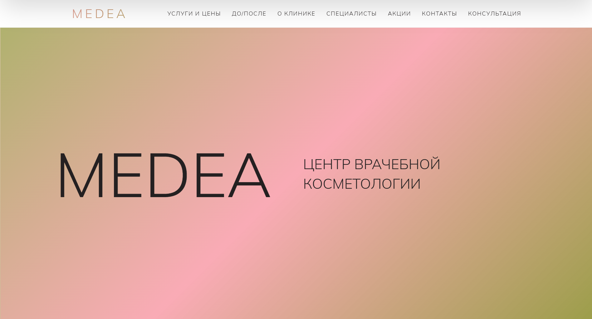
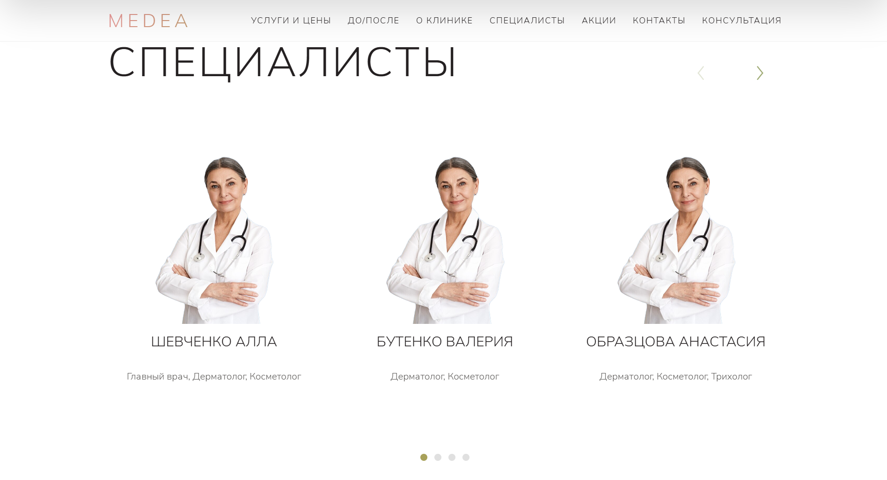
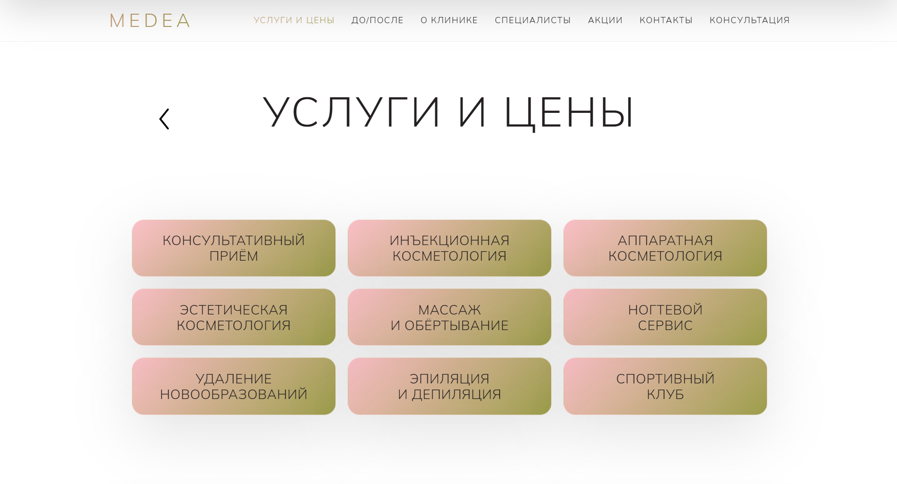
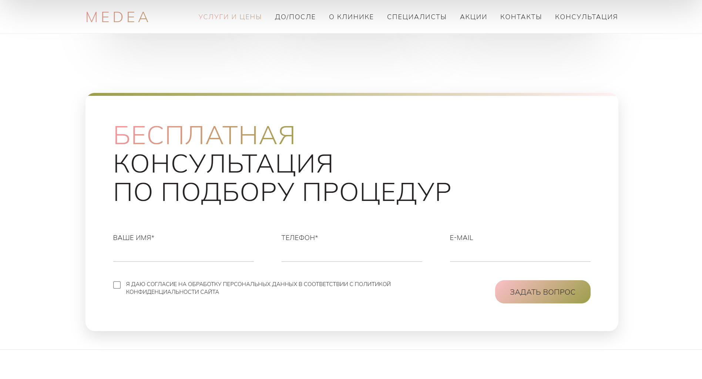
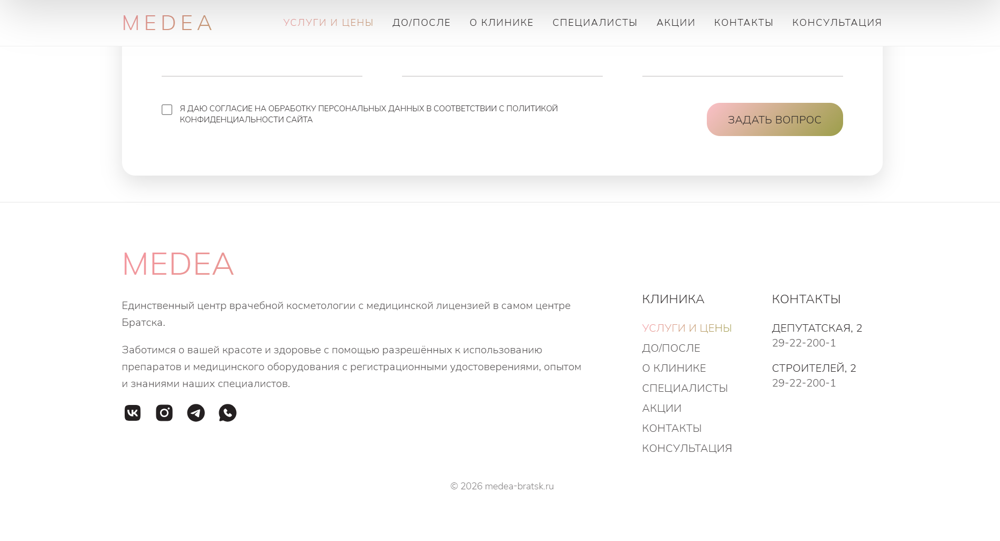

# MEDEA — Сайт центра врачебной косметологии

Сайт центра врачебной косметологии MEDEA в городе Братск с адаптивным дизайном, формами обратной связи и интерактивными элементами.

## Описание

Сайт представляет собой информационный портал медицинской клиники косметологии, включающий:
- Информацию о клинике и услугах
- Каталог специалистов
- Галерею результатов процедур
- Формы для записи на консультацию
- Подписку на акции и специальные предложения
- Контактную информацию с двумя филиалами

## Превью








## Технологии

- **Backend:** PHP 7.4+
- **База данных:** PostgreSQL
- **Frontend:** HTML5, CSS3, JavaScript (Vanilla JS)
- **Архитектура:** Модульная структура с использованием partials

## Требования

- PHP 7.4 или выше
- PostgreSQL 12 или выше
- Веб-сервер (Apache/Nginx) с поддержкой PHP
- Расширение PHP: `pdo_pgsql`

## Установка

### 1. Клонирование репозитория

```bash
git clone <repository-url>
cd website_medea_bratsk
```

### 2. Настройка базы данных

Создайте базу данных PostgreSQL и выполните следующие SQL-запросы:

```sql
-- Таблица для хранения консультаций
CREATE TABLE consultations (
    id SERIAL PRIMARY KEY,
    full_name VARCHAR(255) NOT NULL,
    phone VARCHAR(20) NOT NULL,
    email VARCHAR(255),
    created_at TIMESTAMP DEFAULT CURRENT_TIMESTAMP
);

-- Таблица для подписок на акции
CREATE TABLE promo_subscriptions (
    id SERIAL PRIMARY KEY,
    email VARCHAR(255) NOT NULL UNIQUE,
    created_at TIMESTAMP DEFAULT CURRENT_TIMESTAMP
);

-- Индекс для быстрого поиска по email
CREATE INDEX idx_promo_email ON promo_subscriptions(email);
```

### 3. Конфигурация подключения к БД

Отредактируйте файл `db.php` и укажите параметры подключения к вашей базе данных:

```php
$host = "your_host";
$dbname = "your_database";
$user = "your_username";
$pass = "your_password";
```

### 4. Настройка веб-сервера

#### Apache

Убедитесь, что модуль `mod_rewrite` включен. Создайте файл `.htaccess` в корне проекта (если его нет):

```apache
RewriteEngine On
RewriteCond %{REQUEST_FILENAME} !-f
RewriteCond %{REQUEST_FILENAME} !-d
```

#### Nginx

Добавьте конфигурацию в блок `server`:

```nginx
location / {
    try_files $uri $uri/ /index.php?$query_string;
}

location ~ \.php$ {
    fastcgi_pass unix:/var/run/php/php7.4-fpm.sock;
    fastcgi_index index.php;
    include fastcgi_params;
    fastcgi_param SCRIPT_FILENAME $document_root$fastcgi_script_name;
}
```

### 5. Права доступа

Убедитесь, что веб-сервер имеет права на чтение файлов:

```bash
chmod -R 755 /path/to/website_medea_bratsk
```

## Структура проекта

```
website_medea_bratsk/
├── partials/              # Модульные компоненты
│   ├── header.php        # Шапка сайта с навигацией
│   ├── footer.php        # Подвал сайта
│   └── nav.php           # Конфигурация меню
├── images/                # Изображения
│   ├── licence*.png      # Лицензии клиники
│   └── ...
├── icons/                 # Иконки и SVG
├── fonts/                 # Шрифты
│   └── Winston.woff2     # Кастомный шрифт
├── index.php             # Главная страница
├── uslugi-i-ceny.php     # Услуги и цены
├── akcii.php             # Акции
├── nashi-specialisty.php # Специалисты
├── o-klinike.php         # О клинике
├── rezultaty-procedur.php # Результаты процедур
├── kontakty.php          # Контакты
├── injekcionnaya-kosmetologiya.php
├── konturnaya-plastika.php
├── o-specialiste.php
├── db.php                # Подключение к БД
├── submit_consultation.php # Обработка формы консультации
├── submit_promo.php      # Обработка подписки на акции
├── main.js               # JavaScript функционал
├── styles.css            # Основные стили
├── normalize.css         # Сброс стилей
└── README.md             # Документация
```

## Основные функции

### Навигация

- Единая система навигации через массив `$NAV` в `partials/nav.php`
- Автоматическое определение активной страницы
- Адаптивное мобильное меню (бургер-меню)

### Формы обратной связи

#### Форма консультации (`submit_consultation.php`)

Поля:
- **Имя** (обязательное, минимум 2 символа, только буквы)
- **Телефон** (обязательное, 11 цифр, начинается с 7 или 8)
- **Email** (необязательное)
- **Согласие на обработку данных** (обязательное)

Валидация:
- Клиентская (JavaScript)
- Серверная (PHP)

#### Форма подписки на акции (`submit_promo.php`)

Поля:
- **Email** (обязательное, уникальный)
- **Согласие на обработку данных** (обязательное)

### Интерактивные элементы

#### Модальные окна
- Модалка просмотра лицензий с навигацией
- Модалка формы консультации
- Модалка успешной отправки формы

#### Слайдеры
- **Слайдер специалистов** — карусель карточек специалистов
- **Слайдер лицензий** — автопрокрутка на мобильных устройствах
- **Слайдер "Почему мы"** — автопрокрутка с fade-эффектом
- **Галерея результатов** — адаптивный слайдер (горизонтальный скролл на мобильных)

### Адаптивность

- Полностью адаптивный дизайн
- Мобильное меню
- Оптимизация для различных размеров экранов
- Touch-жесты для слайдеров на мобильных устройствах

## Конфигурация

### Настройка меню

Меню настраивается в файле `partials/nav.php`:

```php
$NAV = [
  'uslugi'   => ['title' => 'Услуги и цены', 'href' => 'uslugi-i-ceny.php'],
  'results'  => ['title' => 'До/после', 'href' => 'rezultaty-procedur.php'],
  // ...
];
```

### Переменные окружения

Для безопасности рекомендуется вынести данные подключения к БД в переменные окружения или использовать `.env` файл.

## Валидация форм

### Правила валидации

**Имя:**
- Минимум 2 символа
- Только буквы (русские и латинские) и пробелы

**Телефон:**
- 11 цифр
- Начинается с 7 или 8
- Автоматическая очистка от нецифровых символов

**Email:**
- Стандартная валидация формата email
- Для консультации — необязательное поле
- Для подписки на акции — обязательное и уникальное

## Стилизация

- Кастомный шрифт **Winston**
- CSS переменные для единообразия
- Градиентные эффекты для акцентов
- Плавные анимации и переходы

## Безопасность

- Использование подготовленных запросов (PDO) для защиты от SQL-инъекций
- Валидация и санитизация входных данных
- Защита от XSS через `htmlspecialchars()`
- Обработка ошибок без вывода чувствительной информации

## Поддерживаемые браузеры

- Chrome (последние версии)
- Firefox (последние версии)
- Safari (последние версии)
- Edge (последние версии)
- Мобильные браузеры (iOS Safari, Chrome Mobile)

## Обработка ошибок

- Логирование ошибок БД в системный лог
- Пользовательские сообщения об ошибках
- Редиректы с параметрами `success` и `error` в URL

## Лицензия

Проект разработан для медицинской клиники MEDEA, Братск.

